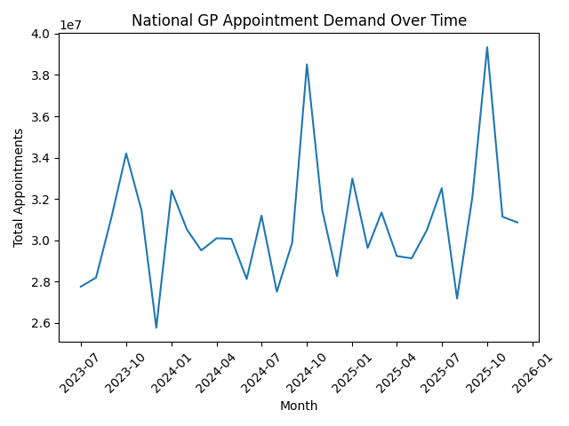
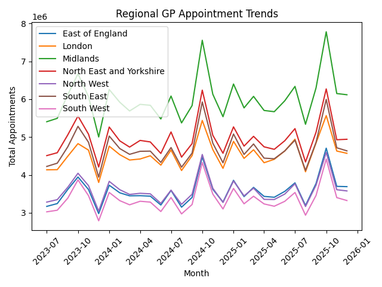
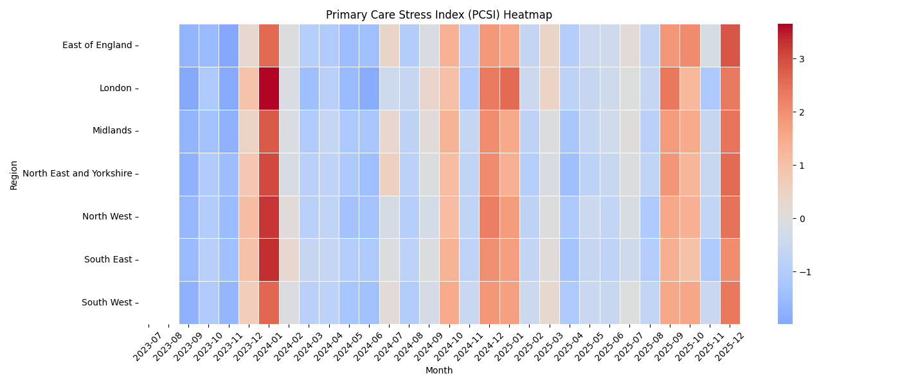
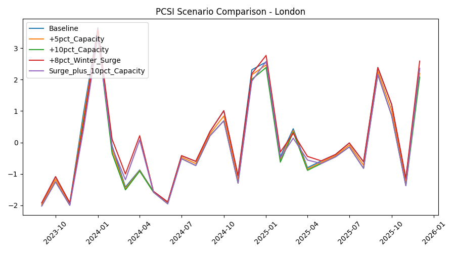
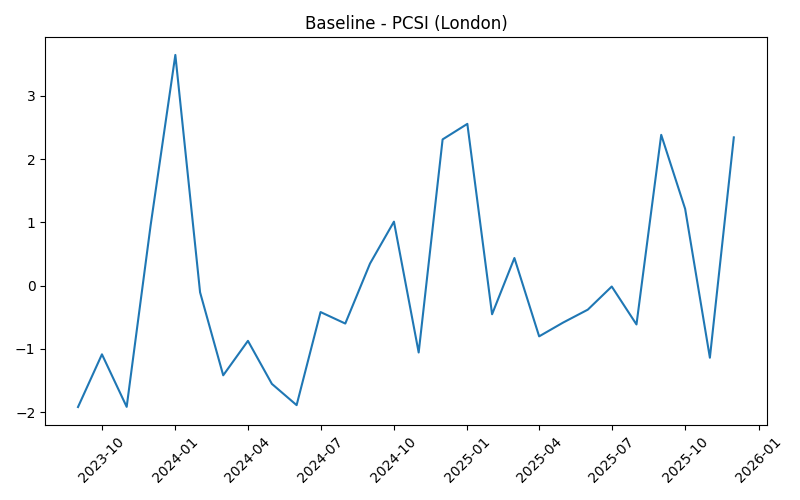
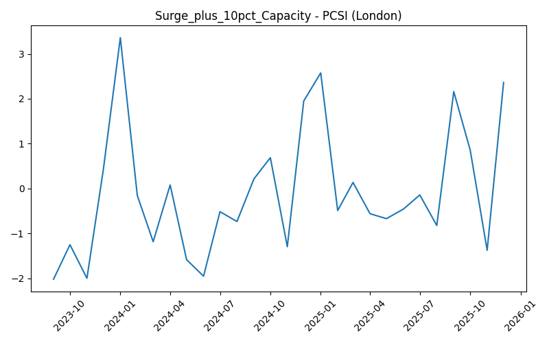
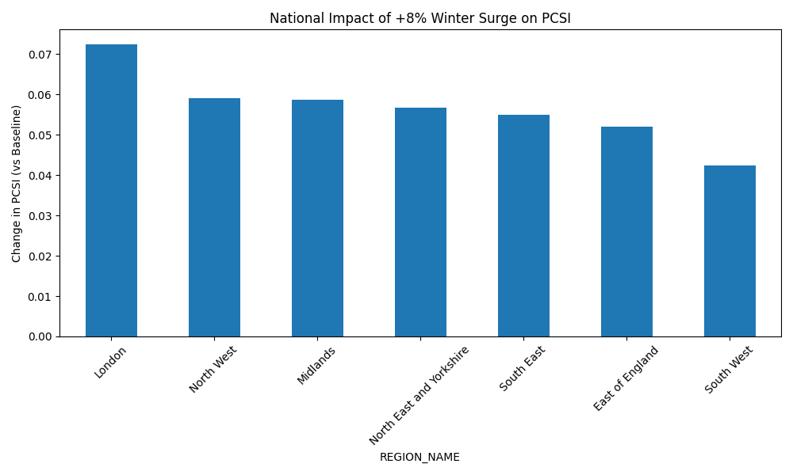
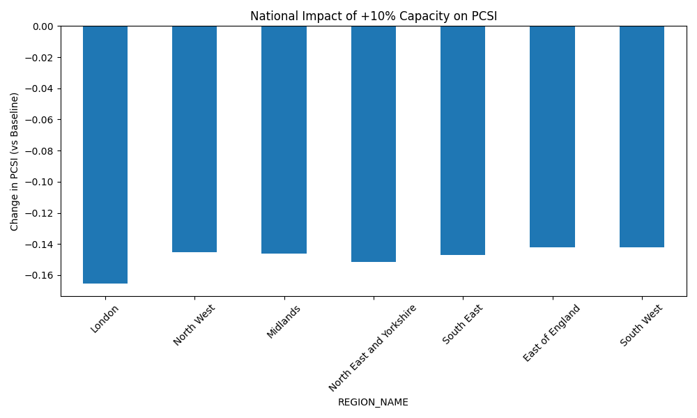

# 🏥 Primary Care Demand Forecasting & Stress Early Warning System

  
  
  
  
  

> A **regional primary care demand forecasting and stress monitoring system** built on real NHS General Practice appointment data — designed to support operational planning and early warning of GP service pressure.

## 📌 Overview

This project evaluates how primary care service pressure evolves under:
- 📈 Seasonal demand growth
- ⚠️ Winter pressure spikes
- 🏥 Capacity adjustments
- 📊 Regional variability

The system combines **forecasting**, **stress quantification**, and **policy simulation** to support NHS operational planning decisions.

## 🎯 Key Research Question

> *Can we design an interpretable stress index that detects early warning signals of GP service pressure?*

The Primary Care Stress Index (PCSI) is designed to:
- Detect early warning signals of GP service pressure
- Capture seasonal stress patterns
- Quantify regional vulnerability
- Evaluate capacity mitigation strategies

## 📊 Exploratory Data Analysis

### 🌍 National GP Appointment Demand Over Time
> National demand shows clear seasonal patterns with winter spikes in Jan 2024 and Jan 2025.

### 📈 Regional GP Appointment Trends
> Midlands consistently shows the highest appointment volume. All regions exhibit similar seasonal patterns.

### ⚡ Same-Day Appointment Percentage Over Time
> London consistently has the highest same-day appointment rate — indicating highest urgent load pressure.

## 📊 Data Source

- **NHS England** — Appointments in General Practice
- Monthly regional data **(Jul 2023 – Dec 2025)**
- **7 NHS regions**
- No patient-level data used ✅

### Regional Features (per region/month)

| Feature | Description |
|---------|-------------|
| Total appointments | Overall demand volume |
| Same-day appointment % | Urgent load indicator |
| Appointment volatility | Service instability |
| Demand growth rate | Pressure trend |

## 📈 Forecasting Approach

| Model | Type |
|-------|------|
| Naïve forecast | Baseline |
| 3-month moving average | Baseline |
| **SARIMA** (12-month seasonality) | **Advanced** |

### 🔬 SARIMA Forecast vs Actual — London
> SARIMA closely tracks actual demand, successfully capturing seasonal patterns and winter spikes.

### Key Result (London Example)

| Model | MAE |
|-------|-----|
| Naïve | 345k |
| **SARIMA** | **205k** |

- ✅ ~40% reduction in forecasting error
- ✅ Successfully captures winter demand spikes

## ⚖️ Stress Index Design (PCSI)

PCSI = Z(Demand Growth) + Z(Same-Day %) + Z(Demand Volatility)

| Component | Measures |
|-----------|----------|
| 📈 Growth | Sudden pressure increase |
| ⚡ Same-day % | Urgent load |
| 📊 Volatility | Service instability |

### 🚦 Stress Thresholds
- PCSI > 1.5 → **High stress**
- PCSI > 2.5 → **Severe stress**

### 🗺️ PCSI Heatmap — All Regions Over Time
> Red = high stress, Blue = low stress. London and North West show the most severe winter stress episodes.

### 📊 PCSI Stress Index — London (with Thresholds)
> Dashed lines show High (1.5) and Severe (2.5) stress thresholds. London breaches severe stress in Jan 2024 and Jan 2025.

### 🔵 PCSI Simulation — London (Original vs +5% Capacity)
> Direct comparison of original vs simulated PCSI showing the impact of a modest 5% capacity increase.

## 🧪 Scenario Simulation Experiments

| Scenario | Description |
|----------|-------------|
| Base | Nominal conditions |
| +5% Capacity | Moderate capacity increase |
| +10% Capacity | Strong capacity increase |
| +8% Winter Surge | Seasonal demand shock |
| Surge + 10% Capacity | Mitigation strategy |

### 📊 All Scenarios Compared — London
> Overlay of all 5 scenarios. Winter surge (red) clearly elevates PCSI while capacity increases (green) reduce it.

### 🔵 Baseline PCSI — London
> Natural stress pattern before any intervention — clear winter spikes visible.

### 📉 +5% Capacity Scenario — London
> Moderate capacity increase reduces stress slightly but winter spikes persist.

### 📉 +10% Capacity Scenario — London
> Strong capacity increase meaningfully reduces stress levels across the year.

### ⚠️ +8% Winter Surge Scenario — London
> Demand shock sharply elevates PCSI — London most vulnerable region.

### ✅ Surge + 10% Capacity Mitigation — London
> Combined mitigation strategy successfully offsets the winter surge impact.

## 📊 Key Findings
- 🏆 Baseline reflects recurring winter stress patterns
- 📉 +5% capacity reduces stress moderately
- 📉 +10% capacity significantly reduces stress
- 📈 +8% winter surge increases stress sharply
- ✅ +10% capacity successfully offsets winter surge impact

## 🔎 Regional Sensitivity

### 🌍 National Impact of +8% Winter Surge
> London shows highest vulnerability to winter demand shocks across all 7 regions.

### 🌍 National Impact of +10% Capacity
> London benefits most from capacity increases — North East & Yorkshire also highly responsive.

- 🔴 **London** — most surge-sensitive region
- 🟢 **North East & Yorkshire** — most capacity-responsive
- 📊 Urban regions show higher volatility overall

## 🚀 Getting Started

### Installation
pip install -r requirements.txt

### Run Full Pipeline
python simulation.py

This will:
1. Run all scenarios
2. Generate regional plots
3. Export scenario summary CSV
4. Save national comparison charts

### 📂 Output Structure
visuals/
    eda/
    simulation/
data/
    processed/
scenario_summary_matrix.csv

## 🛠️ Technical Highlights
- Time-series forecasting (SARIMA)
- Composite stress index construction
- Z-score standardization
- Regional stress modeling
- Capacity elasticity analysis
- Policy scenario simulation
- Structured data pipeline

## ⚠️ Limitations & Future Directions

**Current Limitations:**
- Limited historical window (30 months)
- Simplified capacity adjustment assumption
- No workforce supply-side modeling

**Future Directions:**
- Incorporate GP workforce data
- Probabilistic forecasting
- Constrained optimization for capacity planning
- Interactive dashboard deployment

## 📝 Disclaimer

This project uses **publicly available NHS aggregate data**. No patient-identifiable information is processed.

## 🎯 Project Impact

This project demonstrates how operational GP appointment data can be transformed into:
- A **stress early warning framework**
- A **regional capacity sensitivity tool**
- A **winter pressure planning model**

Made with ❤️ by <a href="https://github.com/ArpitaRandive">Arpita Randive</a>

